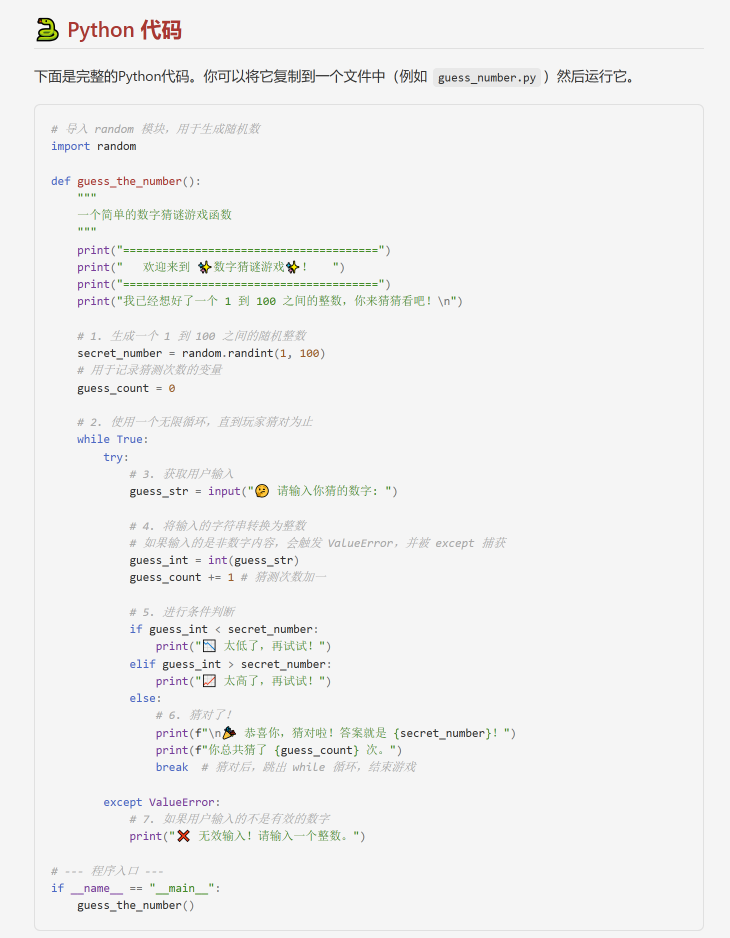
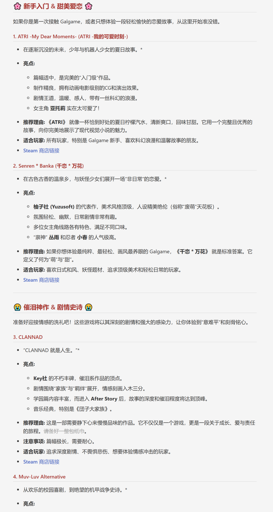

# 多模态AI助手 (multimodal-ai)

[](https://github.com/zhiyu1998/multimodal-ai)
[](./LICENSE)
[](https://github.com/botuniverse/onebot-11)
[](https://www.python.org/)
[](https://github.com/nonebot/nonebot2)

**一个为 Zhenxun Bot 打造的、功能强大的多模态AI插件，将先进的对话与联网搜索能力无缝集成到您的聊天机器人中。**

`multimodal-ai` 插件基于 `zhenxun.services.llm` 模块构建，旨在提供一个统一、智能且可扩展的AI交互体验。它不仅仅是一个聊天插件，更是一个能够理解多种媒体、执行复杂任务的AI助手。

## 📋 目录

- [✨ 核心功能](#-核心功能)
- [🔧 安装与前置要求](#-安装与前置要求)
- [⚙️ 详细配置](#️-详细配置)
- [📖 使用指令](#-使用指令)
- [📋 模型兼容性说明](#-模型兼容性说明)
- [🎨 Markdown主题预览](#-markdown主题预览)
- [🧪 实验性功能](#-实验性功能)
- [❓ 常见问题](#-常见问题)
- [📄 许可证](#-许可证)

---

## ✨ 核心功能

*   **🤖 智能多模态对话**:
    *   支持文本、图片、音频、视频等多种格式的输入。
    *   具备上下文记忆能力，可在设定时间内进行连续对话。
    *   自动检测并利用模型的多模态能力，当模型不支持某种媒体时会给出友好提示。

*   **🌐 联网搜索**:
    *   当检测到需要实时信息的意图时，可自动调用模型的联网搜索能力，提供最新、最准确的回答。

*   **🖼️ 优雅的Markdown渲染**:
    *   自动将包含复杂格式（如代码块、列表、表格）的AI回复渲染成精美的图片。
    *   内置多种CSS主题（如 `light`, `dark`, `cyber`），并支持用户自定义主题，让AI的回复更具观赏性。

*   **⚙️ 灵活的模型与配置管理**:
    *   所有核心功能均可通过机器人指令进行开关和配置。
    *   超级管理员可以动态查看和切换当前使用的AI对话模型。

## 🔧 安装与前置要求

### 安装

推荐通过 Zhenxun Bot 的 **WebUI -> 插件市场** 进行安装。这是最简单、最可靠的方式。


### ⚠️ 重要：前置要求

本插件**强依赖** `Zhenxun Bot` 框架内置的 `LLM服务`。在使用本插件前，**您必须首先正确配置 `zhenxun.services.llm`**。

请确保您已经在 `data/config.yaml` 的 `AI` 配置组中，至少配置了一个可用的 `PROVIDERS`，并填入了正确的 `api_key`。

```yaml
# data/config.yaml 示例
AI:
  # ... 其他配置
  PROVIDERS:
    - name: Gemini  # 提供商名称
      api_key:
        - "AIzaSy...YOUR_GEMINI_API_KEY" # 你的API Key
      api_base: https://generativelan...
      api_type: gemini
      models:
        - model_name: gemini-2.5-flash # 至少配置一个模型
# ...
```

## ⚙️ 详细配置

所有配置项均可在 Zhenxun Bot 的 **WebUI -> 配置管理** 页面中找到，也可以直接编辑 `data/config.yaml` 文件中的 `multimodal-ai` 部分。

| Key                               | 说明                                                                                                                        | 默认值                    |
| :-------------------------------- | :-------------------------------------------------------------------------------------------------------------------------- | :------------------------ |
| `MODEL_NAME`                      | **核心配置**。当前激活的对话模型，格式为 `提供商名/模型名`。支持任何PROVIDERS中配置的模型。**推荐Gemini系列以获得完整多模态支持**。 | `Gemini/gemini-2.5-flash` |
| `enable_md_to_pic`                | 是否启用Markdown转图片功能。                                                                                                | `True`                    |
| `THEME`                           | Markdown转图片使用的主题。对应 `css` 目录下的文件名（无需后缀）。可选：`light`, `dark`, `cute`, `cyber`, `dracula`, `sun`。详见[主题预览](#-markdown主题预览)。 | `light`                   |
| `auxiliary_llm_model`             | 辅助LLM模型名称，用于意图检测等功能。                                                                                       | `Gemini/gemini-2.5-flash` |
| `enable_ai_intent_detection`      | 是否启用AI进行意图识别。关闭时，将使用简单的关键词匹配。                                                                    | `False`                   |
| `context_timeout_minutes`         | 会话上下文超时时间（分钟）。超时后，新对话将开启新的上下文。设置为`0`则关闭上下文对话功能。                                 | `5`                       |
| `enable_mcp_tools`                | **[实验性]** 是否启用MCP工具。此功能目前处于实验阶段，可能不稳定。                                                          | `False`                   |
| `AGENT_MODEL_NAME`                | **[实验性]** 用于Agent工具调用功能的模型名称。                                                                              | `Gemini/gemini-2.5-flash` |

---

## 📖 使用指令

### 🤖 智能对话功能

**命令格式**:
- `ai [你的问题]`
- 引用任意消息并发送 `ai [你的问题]` (支持引用图片、视频、文档等)

**功能说明**: 与AI进行智能对话，支持各种问题咨询、代码编写、知识问答等。

**使用示例**:
```bash
ai 你好，介绍一下你自己
ai 帮我写一段Python代码，实现快速排序
```

**引用消息示例**:
```bash
(引用一张图片) ai 这张图片里有什么？
(引用一段文字) ai 帮我总结一下这段话
```

**效果展示**:


*完整对话界面*


*AI回复内容展示*

---

### 🌐 联网搜索功能

**命令格式**: `ai 搜索 [关键词]` 或 `ai [包含搜索意图的问题]`

**功能说明**: 当需要获取实时信息时，AI会自动调用联网搜索能力，提供最新、最准确的回答。

**使用示例**:
```bash
ai 搜索 今天有什么科技新闻？
ai 搜索 最新的AI技术发展
```

**效果展示**:


*搜索功能完整对话*


*搜索结果展示*

---

### 🖼️ 多模态图片识别

**命令格式**: 发送 `图片` 并附带或回复 `ai [你的问题]`

**功能说明**: 上传图片让AI进行分析，支持图片内容识别、场景描述、文字提取等多种功能。

**使用示例**:
```bash
(发送一张风景照) ai 这是哪里？
(发送一张截图) ai 帮我分析这个图表
```

**效果展示**:


*图片识别完整对话*


*AI图片分析结果*

---

### 🎬 多模态视频分析

**命令格式**: 发送 `视频文件` 并附带或回复 `ai [你的问题]`

**功能说明**: 上传视频让AI进行分析，支持视频内容总结、场景识别、动作分析等功能。

**使用示例**:
```bash
(发送一段视频) ai 总结一下这个视频的内容
(发送一段教学视频) ai 这个视频在讲什么？
(发送一段运动视频) ai 分析一下这个动作
```

**效果展示**:


*视频分析完整对话*


*AI视频分析结果*

---

### ⚙️ 模型与配置管理 (限超级管理员)

**模型管理**:
- **查看可用模型**: `ai模型 列表`
- **切换对话模型**: `ai模型 切换 [提供商名/模型名]`
  ```bash
  ai模型 切换 Gemini/gemini-2.5-pro
  ai模型 切换 DeepSeek/deepseek-reasoner
  ai模型 切换 GLM/glm-4v-plus
  ai模型 切换 Doubao/doubao-seed-1-6-250615
  ```

### 📋 模型兼容性说明

本插件支持通过 `ai模型 切换` 命令切换到任何在 `PROVIDERS` 中配置的模型，包括但不限于：

#### 🟢 完全支持多模态的推荐模型
- **Gemini系列** (推荐)
  - `Gemini/gemini-2.5-flash` - 速度快，成本低
  - `Gemini/gemini-2.5-pro` - 能力强，适合复杂任务
  - `Gemini/gemini-2.5-flash-lite-preview-06-17`
- **Doubao系列**
  - `Doubao/doubao-seed-1-6-250615` - 支持图片、视频、音频分析

#### 🟡 部分支持多模态的模型
- **GLM系列**
  - `GLM/glm-4v-plus` - 支持图片分析，不支持视频/音频

#### 🔴 仅支持文本对话的模型
- **DeepSeek系列**
  - `DeepSeek/deepseek-reasoner` - 仅文本对话，不支持多模态
  - `DeepSeek/deepseek-chat` - 仅文本对话，不支持多模态

> **💡 提示**:
> - 使用不支持多模态的模型时，插件会自动提取图片/视频中的文字内容进行分析
> - 为了获得最佳的多模态体验，强烈推荐使用 **Gemini系列** 模型
> - 可以随时通过 `ai模型 切换` 命令在不同模型间切换，无需重启机器人

**功能开关**:
- **开关Markdown转图片**: `ai配置 md on/off`

**主题管理**:
- **查看Markdown主题**: `ai主题 列表`
- **切换Markdown主题**: `ai主题 切换 [主题名]`
  ```bash
  ai主题 切换 dark
  ```

### 🎨 Markdown主题预览

插件内置了多种精美的Markdown渲染主题，让AI的回复更具观赏性。以下是各主题的效果预览：

#### 🌞 Light 主题 (默认)
清新明亮的浅色主题，适合日常使用。



#### 🚀 Cyber 主题
未来感十足的赛博朋克风格，科技感满满。


#### 🧛 Dracula 主题
经典的Dracula配色方案，深受程序员喜爱。


#### ☀️ Sun 主题
温暖明亮的阳光主题，活力四射。


#### 🎀 Cute 主题
可爱温馨的粉色系主题，萌系风格。


**切换主题示例**:
```bash
ai主题 切换 cyber    # 切换到赛博朋克主题
ai主题 切换 dracula  # 切换到Dracula主题
ai主题 切换 cute     # 切换到可爱主题
```

---

## 🚀 特色功能详解

### 意图识别与智能路由

插件内置了意图识别引擎，可以根据用户的输入，智能地判断用户的目的。

*   **关键词模式**: 默认情况下，通过`搜索`等关键词将请求路由到联网搜索功能。
*   **AI模式 (可选)**: 开启 `enable_ai_intent_detection` 后，会使用一个轻量级LLM来更智能地分析用户意图，可以更准确地判断用户是想闲聊还是想搜索实时信息。

---


## ❓ 常见问题

1.  **AI没有任何回复？**
    *   **检查前置要求**: 确保 `zhenxun.services.llm` 服务已正确配置并且API Key有效、有额度。
    *   **检查模型名称**: 确保 `MODEL_NAME` 配置项填写的模型在您的 `PROVIDERS` 列表中存在。


2.  **如何添加新的AI模型？**
    本插件的模型管理依赖于Zhenxun框架的LLM服务。请前往 `data/config.yaml` 文件，在 `AI.PROVIDERS` 列表中添加或修改模型信息，然后使用 `ai模型 切换` 指令即可。

3.  **为什么发送图片/视频后AI无法识别内容？**
    *   **检查模型支持**: 确保当前使用的模型支持多模态功能。推荐使用Gemini系列或doubao-seed-1-6-250615。
    *   **模型限制**: DeepSeek等模型仅支持文本对话，无法直接分析图片/视频内容。
    *   **切换模型**: 使用 `ai模型 切换 Gemini/gemini-2.5-flash` 切换到支持多模态的模型。

4.  **不同模型有什么区别？**
    *   **Gemini系列**: 完整支持文本、图片、视频、音频分析，推荐日常使用。
    *   **Doubao系列**: 支持多模态，在中文理解方面表现优秀。
    *   **GLM系列**: 支持图片分析，但不支持视频/音频。
    *   **DeepSeek系列**: 仅支持文本对话，推理能力强但无多模态功能。

---

## 📄 许可证

本项目使用 [MIT License](./LICENSE) 开源。